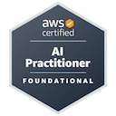
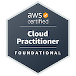
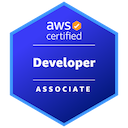
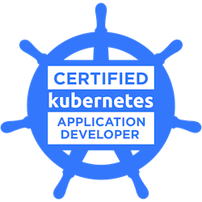
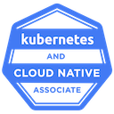
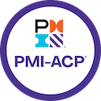
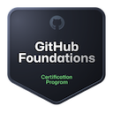
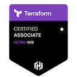

# Jorge Contreras

I lead AI strategy and the systems that run in production.

Currently at McQuilling Partners. I lead the design and development of Sailbot, a maritime intelligence platform.

**[jorgecontreras.dev](https://jorgecontreras.dev)**

## I lead

- Technology roadmaps and engineering teams
- AI strategy for production platforms
- MCP servers and enterprise context for agents
- AI governance: identity, permissions, auditing, and policy
- Cloud and on-prem platform
- ETL pipelines from PDFs, email, and AIS APIs into databases, real-time and scheduled

## Stack

  
  
  
  
  
  
  
  
  
  

## Certifications

  
  
  
  

