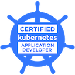

Seasoned technology leader with a passion for tackling complex challenges and delivering practical, customer-focused solutions. My approach centers on understanding customer needs and finding ways to deliver the highest value without compromising on efficiency.

With deep experience in technical strategy, system design, algorithms, computer programming, architecture, cloud computing, and leading projects from inception to delivery, I focus on driving meaningful business impact. 

Currently, I'm dedicated to strategic leadership, aligning technology initiatives with broader business goals, and fostering a culture of innovation. I enjoy partnering with stakeholders at all levels to ensure alignment, inspire teams, and create impactful, scalable solutions that propel organizations forward.

### Skills

**Programming**: Golang, Python, PHP


**Databases**: MySQL, Postgres, NoSQL (Redis)


**Cloud Computing**: AWS, Terraform, Docker, Kubernetes


**Tools**: GitLab, Github, New Relic, Sumo Logic

### Competencies
- Leadership
- Project Management
- Software Architecture and Development
- Problem Solving

### Certifications

- Project Management Institute - Agile Certified Practitioner (PMI-ACP)
- Linux Foundation - Certified Kubernetes Application Developer (CKAD)
- AWS Certified Developer – Associate
- AWS Certified AI Practitioner
- AWS Certified Cloud Practitioner

### Links

- [Github](https://github.com/jorgecontreras)
- [Medium](https://medium.com/@jorge-contreras)
- [LinkedIn](https://www.linkedin.com/in/jorgecontreras-profile)
- [Dev.to](https://dev.to/jorgecontreras)
- [Credly](https://www.credly.com/users/jorge-contreras-rodriguez/badges#)
